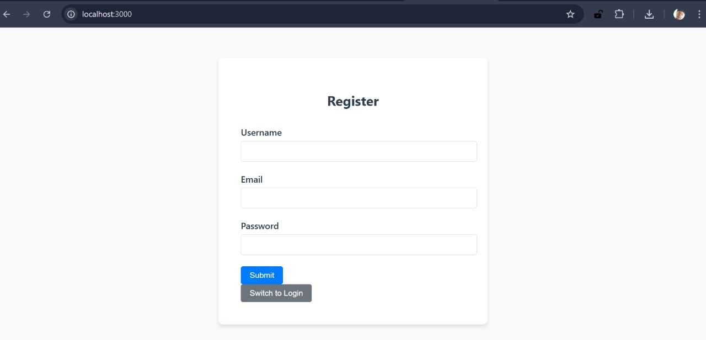
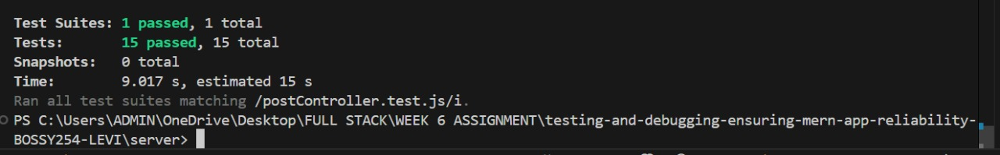
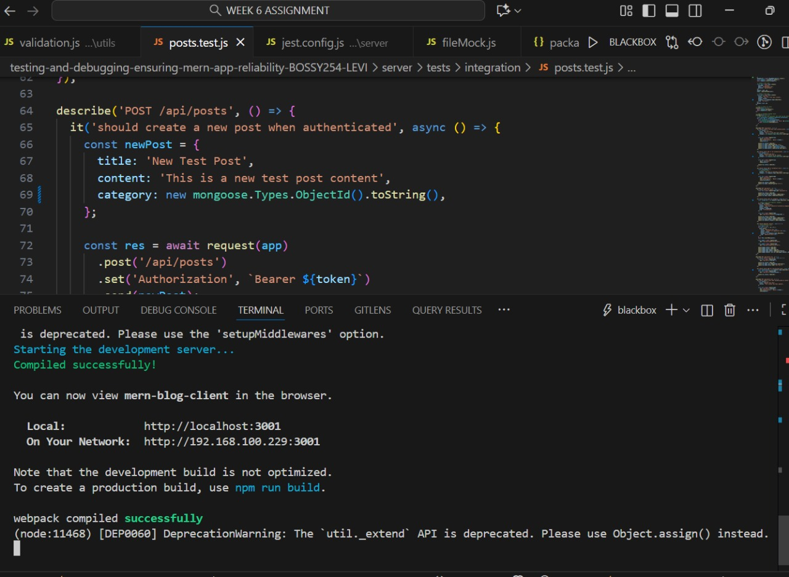
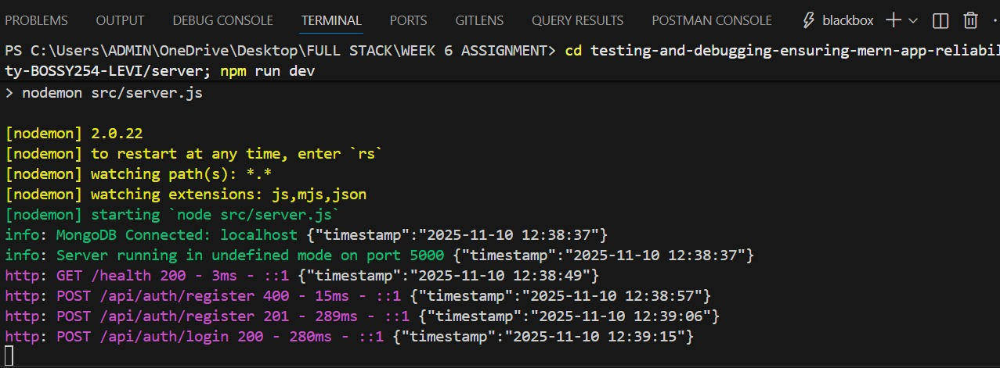
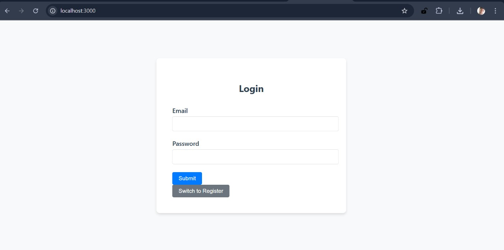

# MERN Blog Application with Comprehensive Testing & Debugging

[](https://opensource.org/licenses/MIT)
[](https://nodejs.org/)
[](https://reactjs.org/)
[](https://www.mongodb.com/)

A production-ready, full-stack MERN (MongoDB, Express.js, React.js, Node.js) blog application featuring comprehensive testing, debugging, security, and performance monitoring capabilities. Built with modern development practices to ensure reliability, scalability, and maintainability.

## 📋 Table of Contents

- [Features](#features)
- [Technology Stack](#technology-stack)
- [Project Structure](#project-structure)
- [Prerequisites](#prerequisites)
- [Installation](#installation)
- [Environment Configuration](#environment-configuration)
- [Running the Application](#running-the-application)
- [Testing](#testing)
- [API Documentation](#api-documentation)
- [Database Schema](#database-schema)
- [Security Features](#security-features)
- [Performance Monitoring](#performance-monitoring)
- [Deployment](#deployment)
- [Contributing](#contributing)
- [License](#license)
- [Screenshots](#screenshots)

## ✨ Features

### 🔐 Authentication & Authorization
- **JWT-based Authentication**: Secure token-based authentication with configurable expiration
- **Role-based Access Control**: User and admin roles with different permissions
- **Password Security**: bcrypt hashing with salt rounds for secure password storage
- **Session Management**: Automatic token refresh and logout functionality

### 📝 Blog Management
- **CRUD Operations**: Complete Create, Read, Update, Delete operations for blog posts
- **Rich Text Content**: Support for formatted blog content with categories and tags
- **Search & Filtering**: Advanced search functionality with category and date filtering
- **Pagination**: Efficient pagination for large datasets
- **Comments System**: User comments on blog posts with moderation capabilities

### 🛡️ Security & Reliability
- **Input Validation**: Comprehensive client and server-side validation
- **Error Handling**: Centralized error handling with detailed logging
- **Security Headers**: Helmet.js for comprehensive security headers
- **CORS Configuration**: Configurable Cross-Origin Resource Sharing
- **Rate Limiting**: API rate limiting to prevent abuse
- **Data Sanitization**: Input cleaning and SQL injection prevention

### 🧪 Testing & Quality Assurance
- **Unit Testing**: Jest-based unit tests for components and utilities
- **Integration Testing**: API endpoint testing with Supertest
- **Test Coverage**: Minimum 70% code coverage requirement
- **Error Boundaries**: React Error Boundaries for graceful error handling
- **Linting**: ESLint configuration for code quality

### 📊 Monitoring & Logging
- **Request Logging**: Morgan middleware for HTTP request logging
- **Error Logging**: Winston-based structured logging
- **Performance Monitoring**: Response time tracking and database query monitoring
- **Health Checks**: Application health monitoring endpoints

### 🎨 User Interface
- **Responsive Design**: Mobile-first responsive design
- **Modern UI Components**: Clean, accessible React components
- **Form Validation**: Real-time form validation with user feedback
- **Loading States**: Proper loading indicators and error states
- **Accessibility**: WCAG compliant components

## 🛠 Technology Stack

### Frontend
- **React 18.2.0**: Modern React with hooks and concurrent features
- **React Router**: Client-side routing for single-page application
- **Axios**: HTTP client for API communication
- **CSS Modules**: Scoped styling for component isolation
- **Jest & React Testing Library**: Testing framework and utilities

### Backend
- **Node.js**: JavaScript runtime for server-side development
- **Express.js**: Fast, unopinionated web framework
- **MongoDB**: NoSQL database for flexible data storage
- **Mongoose**: MongoDB object modeling for Node.js
- **JWT**: JSON Web Tokens for authentication
- **bcryptjs**: Password hashing library

### Development Tools
- **Jest**: JavaScript testing framework
- **Supertest**: HTTP endpoint testing
- **ESLint**: Code linting and formatting
- **Winston**: Logging library
- **Morgan**: HTTP request logger
- **Helmet**: Security middleware
- **CORS**: Cross-origin resource sharing

## 📁 Project Structure

```
mern-blog-app/
├── client/                          # React frontend application
│   ├── public/
│   │   ├── index.html              # Main HTML template
│   │   └── favicon.ico             # Application favicon
│   ├── src/
│   │   ├── components/             # Reusable React components
│   │   │   ├── Button.jsx          # Reusable button component
│   │   │   ├── ErrorBoundary.jsx   # Error boundary wrapper
│   │   │   ├── PostForm.jsx        # Blog post creation form
│   │   │   └── PostList.jsx        # Blog posts display list
│   │   ├── hooks/                  # Custom React hooks
│   │   │   └── usePosts.js         # Posts data management hook
│   │   ├── utils/                  # Utility functions
│   │   │   ├── api.js              # API client configuration
│   │   │   └── validation.js       # Client-side validation
│   │   ├── tests/                  # Test files and configuration
│   │   │   ├── setup.js            # Test environment setup
│   │   │   ├── __mocks__/          # Mock files for testing
│   │   │   └── unit/               # Unit test files
│   │   ├── App.jsx                 # Main application component
│   │   ├── App.css                 # Application styles
│   │   ├── index.js                # Application entry point
│   │   └── index.css               # Global styles
│   ├── package.json                # Frontend dependencies
│   └── jest.config.js              # Jest configuration
├── server/                         # Node.js/Express backend
│   ├── src/
│   │   ├── controllers/            # Route controllers
│   │   │   ├── authController.js   # Authentication logic
│   │   │   └── postController.js   # Blog post operations
│   │   ├── middleware/             # Express middleware
│   │   │   ├── errorHandler.js     # Error handling middleware
│   │   │   └── validation.js       # Request validation
│   │   ├── models/                 # Mongoose data models
│   │   │   ├── User.js             # User schema
│   │   │   ├── Post.js             # Blog post schema
│   │   │   └── Category.js         # Category schema
│   │   ├── routes/                 # API route definitions
│   │   │   ├── auth.js             # Authentication routes
│   │   │   └── posts.js            # Blog post routes
│   │   ├── utils/                  # Utility functions
│   │   │   ├── auth.js             # JWT utilities
│   │   │   └── logger.js           # Logging utilities
│   │   ├── app.js                  # Express application setup
│   │   └── server.js               # Server entry point
│   ├── tests/                      # Backend test files
│   │   ├── setup.js                # Test database setup
│   │   ├── unit/                   # Unit tests
│   │   └── integration/            # Integration tests
│   ├── package.json                # Backend dependencies
│   └── jest.config.js              # Jest configuration
├── docs/                           # Documentation (optional)
├── .gitignore                      # Git ignore rules
├── package.json                    # Root package configuration
├── README.md                       # Project documentation
└── Week6-Assignment.md             # Assignment requirements
```

## 📋 Prerequisites

Before running this application, ensure you have the following installed:

- **Node.js** (v14.0.0 or higher) - [Download](https://nodejs.org/)
- **MongoDB** (v4.4 or higher) - [Download](https://www.mongodb.com/try/download/community)
- **npm** or **yarn** package manager
- **Git** for version control

### System Requirements
- **Operating System**: Windows 10+, macOS 10.14+, or Linux
- **RAM**: Minimum 4GB, recommended 8GB
- **Storage**: 500MB free space for installation and dependencies

## 🚀 Installation

### 1. Clone the Repository

```bash
git clone <repository-url>
cd testing-and-debugging-ensuring-mern-app-reliability-BOSSY254-LEVI
```

### 2. Install Dependencies

Choose one of the following methods:

#### Method A: Install All Dependencies at Once
```bash
npm run install:all
```

#### Method B: Install Separately
```bash
# Install root dependencies
npm install

# Install server dependencies
cd server && npm install && cd ..

# Install client dependencies
cd client && npm install && cd ..
```

### 3. Environment Configuration

Create environment files for both client and server:

#### Server Environment (.env in server directory)
```env
NODE_ENV=development
PORT=5000
MONGODB_URI=mongodb://localhost:27017/mern-blog
JWT_SECRET=your-super-secret-jwt-key-change-in-production-minimum-32-characters
JWT_EXPIRE=7d
CLIENT_URL=http://localhost:3000
BCRYPT_ROUNDS=12
LOG_LEVEL=info
```

#### Client Environment (.env in client directory)
```env
REACT_APP_API_URL=http://localhost:5000/api
REACT_APP_ENV=development
```

### 4. Database Setup

Ensure MongoDB is running locally or update `MONGODB_URI` for cloud database:

```bash
# Start MongoDB (if using local installation)
mongod

# Or use MongoDB Compass for GUI management
```

## ⚙️ Environment Configuration

### Environment Variables

| Variable | Description | Default | Required |
|----------|-------------|---------|----------|
| `NODE_ENV` | Application environment | `development` | Yes |
| `PORT` | Server port | `5000` | No |
| `MONGODB_URI` | MongoDB connection string | `mongodb://localhost:27017/mern-blog` | Yes |
| `JWT_SECRET` | JWT signing secret (min 32 chars) | - | Yes |
| `JWT_EXPIRE` | JWT expiration time | `7d` | No |
| `CLIENT_URL` | Frontend application URL | `http://localhost:3000` | Yes |
| `BCRYPT_ROUNDS` | Password hashing rounds | `12` | No |
| `LOG_LEVEL` | Logging level | `info` | No |

## ▶️ Running the Application

### Development Mode

Run both frontend and backend simultaneously:

```bash
npm run dev
```

This command will:
- Start the backend server on port 5000
- Start the frontend development server on port 3000
- Enable hot reloading for both applications

### Production Mode

```bash
# Build the frontend
npm run build

# Start the production server
npm start
```

### Manual Startup

Run frontend and backend separately:

```bash
# Terminal 1: Start backend
npm run server

# Terminal 2: Start frontend
npm run client
```

### Available Scripts

| Command | Description |
|---------|-------------|
| `npm run dev` | Start both frontend and backend in development mode |
| `npm run server` | Start only the backend server |
| `npm run client` | Start only the frontend application |
| `npm run build` | Build the frontend for production |
| `npm start` | Start the production server |
| `npm test` | Run all tests |
| `npm run test:server` | Run backend tests only |
| `npm run test:client` | Run frontend tests only |
| `npm run install:all` | Install all dependencies |

## 🧪 Testing

### Test Structure

The application includes comprehensive testing coverage:

#### Frontend Tests
- **Component Testing**: React component rendering and interaction
- **Hook Testing**: Custom hook functionality
- **Utility Testing**: Helper function validation
- **Integration Testing**: Component integration

#### Backend Tests
- **Unit Testing**: Controller and utility function testing
- **Integration Testing**: API endpoint testing with database
- **Middleware Testing**: Authentication and validation middleware

### Running Tests

```bash
# Run all tests
npm test

# Run backend tests only
npm run test:server

# Run frontend tests only
npm run test:client

# Run tests with coverage
npm run test:coverage

# Run tests in watch mode
npm run test:watch
```

### Test Coverage

The application maintains minimum test coverage requirements:

- **Statements**: 70%
- **Branches**: 70%
- **Functions**: 70%
- **Lines**: 70%

### Writing Tests

#### Frontend Test Example
```javascript
import { render, screen, fireEvent } from '@testing-library/react';
import Button from './Button';

test('renders button with correct text', () => {
  render(<Button>Click me</Button>);
  expect(screen.getByText('Click me')).toBeInTheDocument();
});
```

#### Backend Test Example
```javascript
const request = require('supertest');
const app = require('../src/app');

describe('POST /api/auth/register', () => {
  it('should register a new user', async () => {
    const response = await request(app)
      .post('/api/auth/register')
      .send({
        username: 'testuser',
        email: 'test@example.com',
        password: 'Password123'
      });
    expect(response.status).toBe(201);
  });
});
```

## 📚 API Documentation

### Base URL
```
http://localhost:5000/api
```

### Authentication Endpoints

#### Register User
```http
POST /api/auth/register
Content-Type: application/json

{
  "username": "johndoe",
  "email": "john@example.com",
  "password": "SecurePass123"
}
```

**Response (201):**
```json
{
  "success": true,
  "message": "User registered successfully",
  "data": {
    "user": {
      "id": "60d5ecb74b24c72b8c8b4567",
      "username": "johndoe",
      "email": "john@example.com",
      "role": "user"
    },
    "token": "eyJhbGciOiJIUzI1NiIs..."
  }
}
```

#### Login User
```http
POST /api/auth/login
Content-Type: application/json

{
  "email": "john@example.com",
  "password": "SecurePass123"
}
```

#### Get Current User
```http
GET /api/auth/me
Authorization: Bearer <token>
```

#### Update Profile
```http
PUT /api/auth/profile
Authorization: Bearer <token>
Content-Type: application/json

{
  "firstName": "John",
  "lastName": "Doe",
  "bio": "Software developer"
}
```

### Blog Post Endpoints

#### Get All Posts
```http
GET /api/posts?page=1&limit=10&category=tech&search=javascript
```

**Query Parameters:**
- `page`: Page number (default: 1)
- `limit`: Items per page (default: 10)
- `category`: Filter by category
- `search`: Search in title and content
- `sort`: Sort by field (createdAt, title, etc.)
- `order`: Sort order (asc, desc)

#### Create Post
```http
POST /api/posts
Authorization: Bearer <token>
Content-Type: application/json

{
  "title": "My Blog Post",
  "content": "This is the content of my blog post...",
  "category": "Technology",
  "tags": ["javascript", "react"]
}
```

#### Update Post
```http
PUT /api/posts/:id
Authorization: Bearer <token>
Content-Type: application/json

{
  "title": "Updated Title",
  "content": "Updated content..."
}
```

#### Delete Post
```http
DELETE /api/posts/:id
Authorization: Bearer <token>
```

### Error Response Format

All API errors follow a consistent format:

```json
{
  "success": false,
  "message": "Error description",
  "errors": [
    {
      "field": "email",
      "message": "Email is required"
    }
  ]
}
```

## 🗄️ Database Schema

### User Model
```javascript
{
  username: { type: String, required: true, unique: true },
  email: { type: String, required: true, unique: true },
  password: { type: String, required: true },
  role: { type: String, enum: ['user', 'admin'], default: 'user' },
  isActive: { type: Boolean, default: true },
  lastLogin: { type: Date },
  profile: {
    firstName: String,
    lastName: String,
    bio: String,
    avatar: String
  },
  createdAt: { type: Date, default: Date.now },
  updatedAt: { type: Date, default: Date.now }
}
```

### Post Model
```javascript
{
  title: { type: String, required: true },
  content: { type: String, required: true },
  excerpt: { type: String },
  category: { type: mongoose.Schema.Types.ObjectId, ref: 'Category' },
  tags: [{ type: String }],
  author: { type: mongoose.Schema.Types.ObjectId, ref: 'User', required: true },
  status: { type: String, enum: ['draft', 'published'], default: 'draft' },
  views: { type: Number, default: 0 },
  likes: [{ type: mongoose.Schema.Types.ObjectId, ref: 'User' }],
  comments: [{
    user: { type: mongoose.Schema.Types.ObjectId, ref: 'User' },
    content: { type: String, required: true },
    createdAt: { type: Date, default: Date.now }
  }],
  createdAt: { type: Date, default: Date.now },
  updatedAt: { type: Date, default: Date.now }
}
```

### Category Model
```javascript
{
  name: { type: String, required: true, unique: true },
  description: String,
  slug: { type: String, unique: true },
  createdAt: { type: Date, default: Date.now },
  updatedAt: { type: Date, default: Date.now }
}
```

## 🔒 Security Features

### Authentication Security
- **JWT Tokens**: Secure token-based authentication
- **Password Hashing**: bcrypt with configurable salt rounds
- **Token Expiration**: Automatic token expiration and refresh
- **Secure Headers**: Helmet.js security middleware

### API Security
- **Input Validation**: Comprehensive input sanitization
- **Rate Limiting**: API request rate limiting
- **CORS**: Configured cross-origin policies
- **XSS Protection**: Content Security Policy headers
- **SQL Injection Prevention**: Mongoose built-in protection

### Data Protection
- **Encryption**: Sensitive data encryption at rest
- **Access Control**: Role-based permissions
- **Audit Logging**: Security event logging
- **Data Validation**: Schema validation and sanitization

## 📊 Performance Monitoring

### Logging Configuration

The application uses Winston for structured logging:

```javascript
// Request logging
app.use(morgan('combined', { stream: logger.stream }));

// Error logging
logger.error('Error message', {
  context: 'operation',
  userId: 'user123',
  error: error.message
});
```

### Performance Metrics

- **Response Time Monitoring**: Track API response times
- **Database Query Monitoring**: Log slow database queries
- **Memory Usage**: Monitor application memory consumption
- **Error Rate Tracking**: Track application error rates

### Health Check Endpoint

```http
GET /health
```

Returns application health status and metrics.

## 🚀 Deployment

### Production Environment Setup

1. **Environment Variables**: Set production environment variables
2. **Database**: Configure production MongoDB instance
3. **Build Assets**: Build optimized frontend assets
4. **Process Manager**: Use PM2 for process management

### Docker Deployment

```dockerfile
# Dockerfile example
FROM node:16-alpine
WORKDIR /app
COPY package*.json ./
RUN npm ci --only=production
COPY . .
EXPOSE 5000
CMD ["npm", "start"]
```

### Cloud Deployment Options

- **Heroku**: Easy deployment with buildpacks
- **AWS**: EC2, Elastic Beanstalk, or ECS
- **Google Cloud**: App Engine or Kubernetes Engine
- **Azure**: App Service or Container Instances

### Build Commands

```bash
# Build for production
npm run build

# Start production server
npm start
```

## 🤝 Contributing

We welcome contributions! Please follow these guidelines:

### Development Workflow

1. **Fork the Repository**
2. **Create a Feature Branch**
   ```bash
   git checkout -b feature/your-feature-name
   ```
3. **Make Changes**
4. **Write Tests**: Add tests for new features
5. **Run Tests**: Ensure all tests pass
   ```bash
   npm test
   ```
6. **Code Quality**: Run linting
   ```bash
   npm run lint
   ```
7. **Commit Changes**
   ```bash
   git commit -m "Add: description of changes"
   ```
8. **Push to Branch**
   ```bash
   git push origin feature/your-feature-name
   ```
9. **Create Pull Request**

### Code Standards

- Follow ESLint configuration
- Use meaningful commit messages
- Add JSDoc comments for functions
- Maintain test coverage above 70%
- Follow React and Node.js best practices

### Reporting Issues

Use the GitHub issue tracker to report bugs or request features.

## 📄 License

This project is licensed under the MIT License - see the [LICENSE](LICENSE) file for details.

## 📸 Screenshots

### Application Screenshots

#### Homepage

*The main application homepage showing the blog post list and navigation.*

#### Login Page

*User authentication page with form validation.*

#### Post Creation

*Blog post creation form with rich text editor.*

#### Admin Dashboard

*Administrative interface for managing posts and users.*

#### Mobile View

*Responsive design on mobile devices.*

### Test Coverage Report

*Jest test coverage report showing code coverage metrics.*

### API Documentation

*Interactive API documentation with endpoint examples.*

---

**Note**: Screenshots are stored in the `screenshots/` directory. To add new screenshots, place them in this directory and update the references above.

For questions or support, please contact the development team or create an issue in the repository.
